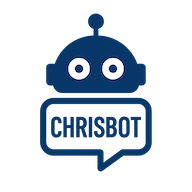

# <p align="center"></p>
# <p align="center">Chrisbot</p>

<p align="center">Laboratorio di agenti AI con backend Node.js/Express, frontend Next.js, MySQL, task scheduler e integrazioni OpenAI, Ollama, MCP e Telegram.</p>

## Avvio rapido con Docker Compose

Prerequisiti:

- Docker
- Docker Compose

1. Copia `.env.example` in `.env`.

```bash
cp .env.example .env
```

2. Inserisci almeno queste proprietà nel file `.env` per l'avvio base con `docker compose` e MySQL incluso:

```env
ACCESS_TOKEN_SECRET=replace-with-a-long-random-secret
MYSQL_ROOT_PASSWORD=change-root-password
MYSQL_USER=chrisbot
MYSQL_PASSWORD=change-me
MYSQL_DATABASE=chrisbot
```

3. Avvia i servizi:

```bash
docker compose up --build
```

4. Al primo avvio verrà chiesto di creare un utente locale admin.
   Successivamente sarà possibile configurare login con Azure e disattivare utenti locali.

Servizi esposti:

- Backend: `http://127.0.0.1:3000`
- Frontend: `http://127.0.0.1:3001`
- MySQL: `127.0.0.1:3307`

## Avvio locale senza Docker

Per avviare contemporaneamente backend e frontend:

```bash
npm run dev:all
```

## Impostazioni base

- Impostazioni/Modelli AI: configura una api key OpenAI o i server Ollama necessari(necessario avviare ollama e attivare dalle impostazioni "Expose ollama to the network").
- Impostazioni/Server MCP: aggiungi i tuoi server MCP per importare i tool da rendere disponibili agli agenti.
- Agenti: Crea worker o orchestratori in base alle esigenze, assegna permessi, toll MCP e collegali tra loro.

## Documentazione

- [Struttura env](docs/struttura-env.md)
- [Funzioni](docs/funzioni.md)

## Last updates

- **Alive agents**: una nuova modalità pensata per trasformare alcuni agenti in presenze operative continue, capaci di lavorare in autonomia in una chat dedicata e sempre coerente.
- Gli amministratori possono attivare questa funzione solo sugli agenti abilitati alla chat diretta, definendo ritmo di interazione, contesto conversazionale e obiettivi da seguire nel tempo.
- La nuova sezione **Alive agents** rende immediato monitorare, avviare, mettere in pausa e riprendere agenti persistenti, mantenendo una singola conversazione per agente e una gestione più ordinata delle attività.
- L’esperienza è progettata per supportare flussi continuativi: l’agente può proseguire il proprio ciclo anche in background, conservare memoria e obiettivi aggiornabili e offrire maggiore continuità operativa nelle attività ripetitive o di presidio.
