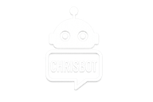

# <p align="center"></p>
# <p align="center">Chrisbot</p>

<p align="center">Una piattaforma sperimentale per creare, governare e far collaborare agenti AI in un ambiente operativo completo.</p>

Chrisbot nasce come laboratorio pratico per trasformare gli agenti AI da semplici chatbot a strumenti di lavoro configurabili: ogni agente può avere modelli, permessi, strumenti MCP, memoria conversazionale, routine pianificate e canali di notifica. L'obiettivo è offrire una base concreta per costruire assistenti personali, worker automatizzati e orchestratori capaci di muoversi tra chat, task, integrazioni esterne e flussi ricorrenti.

Il progetto include un backend Node.js/Express, un frontend Next.js, persistenza MySQL, scheduler, gestione degli accessi, integrazioni OpenAI/Ollama, supporto MCP, notifiche web push e Telegram.

## Cosa puoi farci

- Creare agenti AI con ruoli, obiettivi e permessi distinti.
- Collegare modelli OpenAI o runtime locali Ollama.
- Esporre tool MCP agli agenti in modo controllato.
- Gestire chat dirette, task pianificati e routine ricorrenti.
- Attivare agenti persistenti con la modalità Alive agents.
- Ricevere notifiche via portale, web push o Telegram.
- Avviare tutto in locale con Docker Compose.

## Avvio rapido con Docker Compose

Prerequisiti:

- Docker
- Docker Compose

1. Copia `.env.example` in `.env`.

```bash
cp .env.example .env
```

2. Inserisci almeno queste proprietà nel file `.env` per l'avvio base con `docker compose` e MySQL incluso:

```env
ACCESS_TOKEN_SECRET=replace-with-a-long-random-secret
MYSQL_ROOT_PASSWORD=change-root-password
MYSQL_USER=chrisbot
MYSQL_PASSWORD=change-me
MYSQL_DATABASE=chrisbot
MYSQL_HOST=mysql
COMPOSE_PROFILES=local-mysql
```

3. Avvia i servizi:

```bash
docker compose up --build
```

4. Al primo avvio verrà chiesto di creare un utente locale admin.
   Successivamente sarà possibile configurare login con Azure e disattivare utenti locali.

Servizi esposti:

- Backend: `http://127.0.0.1:3000`
- Frontend: `http://127.0.0.1:3001`
- MySQL: `127.0.0.1:3307`

Per usare un MySQL esterno, imposta `MYSQL_HOST` all'host del database e lascia
`COMPOSE_PROFILES` vuoto: in questo modo `docker compose up --build` non crea il
container `chrisbot-mysql`.

## Avvio locale senza Docker

Per avviare contemporaneamente backend e frontend:

```bash
npm run dev:all
```

## Impostazioni base

- Impostazioni/Modelli AI: configura una api key OpenAI o i server Ollama necessari(necessario avviare ollama e attivare dalle impostazioni "Expose ollama to the network").
- Impostazioni/Server MCP: aggiungi i tuoi server MCP per importare i tool da rendere disponibili agli agenti.
- Agenti: Crea worker o orchestratori in base alle esigenze, assegna permessi, toll MCP e collegali tra loro.

## Documentazione

- [Struttura env](docs/struttura-env.md)
- [Funzioni](docs/funzioni.md)

## Licenza

MIT. Vedi [LICENSE](LICENSE).

## Last updates

- **Alive agents**: una nuova modalità pensata per trasformare alcuni agenti in presenze operative continue, capaci di lavorare in autonomia in una chat dedicata e sempre coerente.
- Gli amministratori possono attivare questa funzione solo sugli agenti abilitati alla chat diretta, definendo ritmo di interazione, contesto conversazionale e obiettivi da seguire nel tempo.
- La nuova sezione **Alive agents** rende immediato monitorare, avviare, mettere in pausa e riprendere agenti persistenti, mantenendo una singola conversazione per agente e una gestione più ordinata delle attività.
- L’esperienza è progettata per supportare flussi continuativi: l’agente può proseguire il proprio ciclo anche in background, conservare memoria e obiettivi aggiornabili e offrire maggiore continuità operativa nelle attività ripetitive o di presidio.
